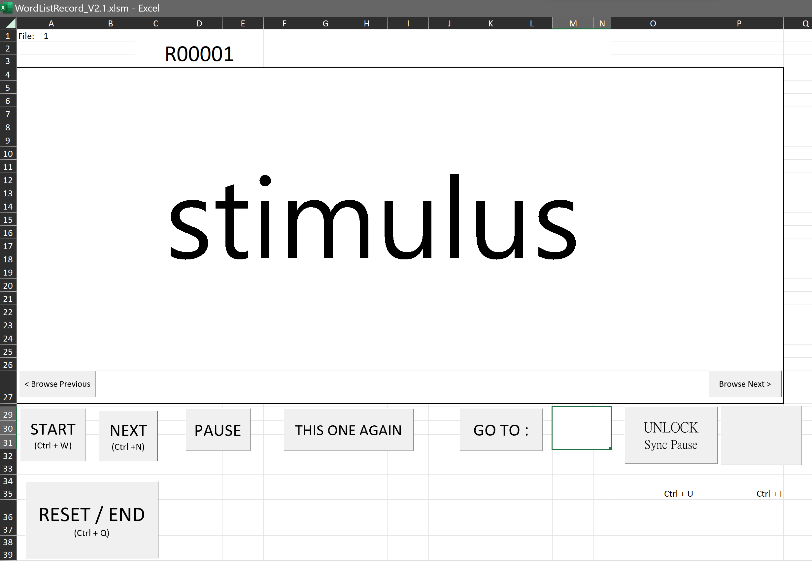

# WordlistRecord
### WordlistRecord: Stimuli displaying and recording for psychological or linguistic studies
Excel VBA (Visual Basic for Applications)
- This application supports Windows 10 or 11 only and does not support online versions of Excel.

## Follow the instruction in "How_to_Activate_Excel_VBA.pptx" to activate VBA for the first time.
## WordlistRecord  

Citation: 

Chen, Wei-Rong (2026). WordlistRecord V3(Version 26.04.01). Retrieved from https://github.com/WeirongChen/WordlistRecord
### COPYRIGHT, LICENSE & DISCLAIMER
Copyright (C) 2020 Wei-Rong Chen <wei-rong.chen[AT]yale.edu>  
This program is free software under GNU General Public License, version 3.  
This program is distributed WITHOUT ANY FORM of EXPRESS or IMPLIED WARRANTY and ANY SUPPORT.    
See the GNU General Public License for more details.  
Update: 
2026.04.01  Added a function to export raw content in TimeLog sheet.
